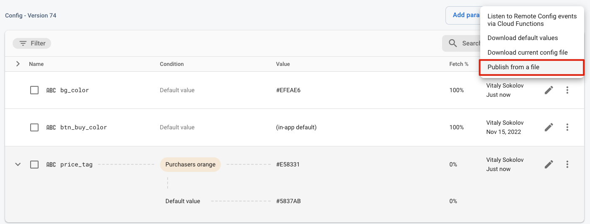

# Demo App from Firebase Engage Training

## Copyright

**This is not an officially supported Google product.**  
Copyright 2021 Google LLC. This solution, including any related sample code or data, is made available on an “as is,” “as available,” and “with all faults” basis, solely for illustrative purposes, and without warranty or representation of any kind. This solution is experimental, unsupported and provided solely for your convenience. Your use of it is subject to your agreements with Google, as applicable, and may constitute a beta feature as defined under those agreements. To the extent that you make any data available to Google in connection with your use of the solution, you represent and warrant that you have all necessary and appropriate rights, consents and permissions to permit Google to use and process that data. By using any portion of this solution, you acknowledge, assume and accept all risks, known and unknown, associated with its usage, including with respect to your deployment of any portion of this solution in your systems, or usage in connection with your business, if at all.

## Training
[Firebase Engage: Remote Config, A/B Test and Personalization](https://marketingplatformacademy.withgoogle.com/events/fireside-engage-remote-config-ab-test-personalisation-details?mkt_tok=OTE3LVpNTC05ODAAAAGIGX2AMYndUs2Rhh7VOBM76e4DPC-Qxc1r4A9JCZZ4SqDeLZYC72MrKwb3dPBLGXLp7ojB1AdbyOBg2ojqzTBae1TPEmzBRA6ia00w)
## Usage
1. [Register Android App in Firebase Console](https://firebase.google.com/docs/android/setup#create-firebase-project) **or** [rename package name](https://stackoverflow.com/questions/16804093/rename-package-in-android-studio) to match an app existing in the console  
2. Replace `google-services.json` with yours [downloaded from the Firebase Console](https://support.google.com/firebase/answer/7015592?hl=en#android&zippy=%2Cin-this-article)
3. (OPTIONALLY) Upload remote_config_console.json to quickly reproduce Remote Configuration matching this app

